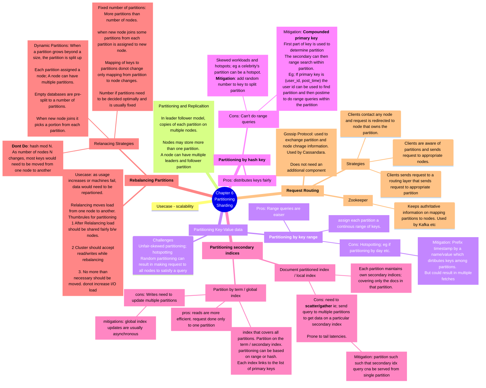

```mermaid
mindmap
  root((Chapter 6<br/>Partitioning<br/>Sharding))
    Usecase - scalability
    id1["Partitioning and Replicaltion<br/>
        In leader follower model, copies of each partition on multiple nodes.<br>
        Nodes may store more than one partition. 
        A node can have multiple leaders and follower partition"]
    id1["Partitioning Key-Value data"]
        Challenges<br/>Unfair-skewed partitioning; hotspotting <br/>Random partitioning can result in making request to all nodes to satisfy a query
        id1["**Partitioning by key range**"]
            id1["assign each partition a continous range of keys."]
            id1["Pros: Range queries are eaiser"]
            id1["Cons: Hotspotting; eg if partitioning by day etc."]
                id1["Mitigation: Prefix timestamp by a name/value which dirtibutes keys among partitions. <br/> But could result in multiple fetches"]
    id1["**Partitioning by hash key**"]
        id1["Pros: distributes keys fairly"]
        id1["Cons: Can't do range queries"]
            id1["Mitigation: **Compounded primary key** <br/> First part of key is used to determine partition
            The secondary can then range search within partition. 
            Eg; If primary key is (user_id, post_time) the user id can be used to find partition and then postime to do range queries within the partition"]
            id1["Skewed workloads and hotspots; eg a celebrity's partition can be a hotspot.
            **Mitigation**: add random number to key to split partition"]
    id1["**Partitioning secondary indices**"]
        id1["Document partitioned index / local index"]
            id1["Each partition maintains own secondary indices; covering only the docs in that partition."]
            id1["Cons: need to **scatter/gather** ie; send query to multiple partitions to get data on a particular secondary index<br/>
            Prone to tail latencies."] 
                id1["Mitigation: partition such such that secondary idx query cna be served from single partition"]
        id1["Partition by term / global index"]
            id1["index that covers all partitions. Partition on the term / secondary index.<br/> partitioning can be based on range or hash.
            Each index links to the list of primary keys"]
            id["pros: reads are more efficient. request done only to one partition"]
            id["cons: Writes need to update multiple partitions"]
                id["mitigations: global index updates are usually asynchronous"]
    id1["**Rebalancing Partitions**"]
        id1["Usecase: as usage increases or machines fail, data would need to be repartioned. <br/>
        Relalancing moves load from one node to another. Thumbrules for partitioning <br/> 1 After Relalancing load should be shared fairly b/w nodes.
        <br/> 2 Cluster should accept read/writes while rebalancing
        <br/> 3. No more than necessary should be moved. donot increase I/O load"]
        id1["Relanacing Strategies"]
            id1["**Dont Do**: hash mod N. <br/>As number of nodes N changes, most keys would need to be moved from one node to another"]
            id1["Fixed number of partitions: More partitions than number of nodes. <br/> 
            when new node joins some partitions from each partition is assigned to new node. <br/>
            Mapping of keys to partitions donot change only mapping from partition to node changes. <br/>
            Number if partitions need to be decided optimally and is usually fixed"]
            id1["Dynamic Partitions: When a partition grows beyond a size, the partition is split up <br/>
            Each partition assigned a node; A node can have multiple partitions.<br/>
            Empty databases are pre-split to a number of partitions. <br/>
            When new node joins it picks a portion from each partition."]
    id1["**Request Routing**"]
        id1[Strategies]
            Clients contact any node and request is redirected to node that owns the partition.
            Clients sends request to a routing layer that sends request to appropriate partition
            Clients are aware of partitions and sends request to appropriate nodes.
        id1[Zookeeper]
            Keeps authritative information on mapping partitions to nodes. Used by Kafka etc
        id1[Gossip Protocol: used to exchange partition and node chnage information. Used by Cassandara.
        <br/> Does not need an additional component]
```

